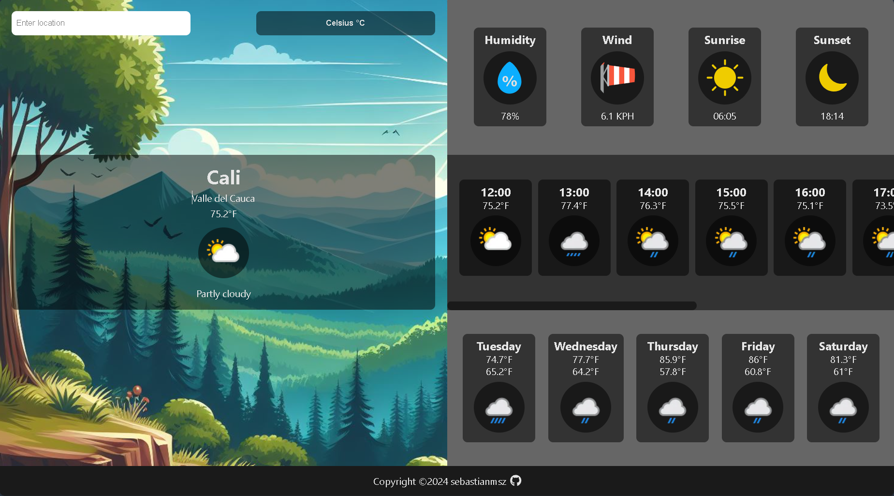

# Weather App 🌦️

This is a weather app that allows you to get the current weather information for a specific location. It utilizes asynchronous programming and API calls to fetch the weather data from Weather API. The app is built using webpack to bundle and optimize the JavaScript code.

My goal behind the building of this app was to practice working with asynchronous JavaScript, making API calls, and handling the response data. Some of the the new plugins and loaders that I used in this project are: prettier, eslint, babel and fontawesome.

## Screenshot



## Live Demo

Experience the app by clicking [here](https://sebastianmsz.github.io/weather-app).

## Installation

1. Clone the repository:

    ```bash
    git clone https://github.com/sebastianmsz/weather-app.git
    ```

2. Install the dependencies:

    ```bash
    npm install
    ```

## Usage

1. Start the development server:

    ```bash
    npm start
    ```

2. Open your web browser and navigate to `http://localhost:8080`.

3. Enter the location for which you want to get the weather information.

4. The app will display the current weather conditions for the specified location.

## Project Structure

The project is organized into the following directories:

-   `src`: Contains the JavaScript modules and UI components.
-   `public`: Contains the static files such as the HTML template and images.
-   `dist`: Contains the bundled and optimized files generated by webpack.

## Technologies Used

-   Webpack: A module bundler for JavaScript applications.
-   JavaScript: The programming language used for the app's logic.
-   HTML: The markup language used for the app's user interface.
-   CSS: The styling language used for the app's UI.

## Contributing

Contributions are welcome! If you find any issues or have suggestions for improvements, please open an issue or submit a pull request.

## Contact

If you want to contact me you can reach me via email at sebastian.msz@proton.me.
