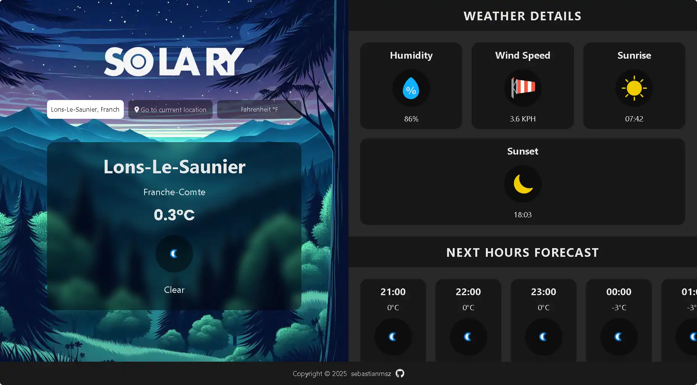

# Solary ☀️

Solary is a weather application that provides current weather information and forecasts for any location. Built with asynchronous JavaScript, Weather API integration, and webpack bundling, Solary is an ideal project to learn about API handling, modern JavaScript programming, and responsive user interface design.

## Features

- **Current Weather**: Displays real-time temperature, condition, humidity, wind, and sunrise/sunset times.
- **Hourly Forecast**: Provides a 10-hour forecast including temperature and weather conditions.
- **Extended Forecast**: Shows forecast details for upcoming days.
- **Search Autocomplete**: Quickly find your location with real-time suggestions.
- **Unit Toggle**: Switch between Celsius and Fahrenheit with ease.
- **Responsive Design**: Optimized for desktop, tablet, and mobile experiences.
- **Themed Backgrounds**: Automatically adjusts backgrounds for day and night.

## Screenshot



## Live Demo

Experience the app live by clicking [here](https://sebastianmsz.github.io/solary).

## Installation

1. **Clone the Repository**

    ```bash
    git clone https://github.com/sebastianmsz/solary.git
    ```

2. **Install Dependencies**

    ```bash
    npm install
    ```

3. **Start the Development Server**

    ```bash
    npm start
    ```

4. **Access the App**

   Open your web browser and navigate to [http://localhost:8080](http://localhost:8080).

## Project Structure

- **src/**: Contains JavaScript modules and UI components.
- **public/**: Contains static files such as HTML templates and images.
- **dist/**: Contains the bundled and optimized files generated by webpack.
- **configuration files**: Includes ESLint, Prettier, and Babel configurations.

## Technologies Used

- **JavaScript (ESNext)**
- **Webpack**: For module bundling and development server.
- **Babel**: Transpiling modern JavaScript for broader browser support.
- **HTML & CSS**: For building responsive user interfaces.
- **Weather API**: For fetching current weather and forecast data.
- **FontAwesome**: For incorporating icons.
- **ESLint & Prettier**: For code linting and formatting.

## How It Works

1. **Asynchronous API Calls**: The app fetches current weather and forecast data using asynchronous calls.
2. **Dynamic UI Rendering**: JavaScript dynamically updates the DOM based on user location, toggle between temperature units, and search autocompletion.
3. **Responsive Design Principles**: CSS media queries ensure that the app is fully responsive and adapts to various screen sizes.

## Contributing

Contributions are always welcome! If you find any issues or have suggestions for improvements, please open an issue or submit a pull request.

## License

This project is licensed under the ISC License.

## Contact

For any inquiries or feedback, reach out via email: [sevas.molina2004@gmail.com](mailto:sevas.molina2004@gmail.com)
